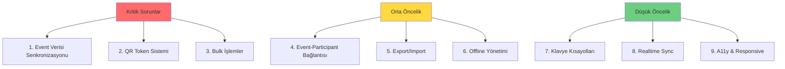

I have created the following plan after thorough exploration and analysis of the codebase. Follow the below plan verbatim. Trust the files and references. Do not re-verify what's written in the plan. Explore only when absolutely necessary. First implement all the proposed file changes and then I'll review all the changes together at the end.

# Program Analizi ve Eksiklikler Raporu

## Gözlemler

Canlı bağış toplama sistemi React, TypeScript ve Vite ile geliştirilmiş modern bir web uygulamasıdır. Sistem hash-based routing kullanarak çoklu ekran yönetimi sağlamaktadır. Mevcut DIAGNOSTIC_REPORT.md dosyası eski bir analizi içermekte ve bazı sorunlar çözülmüş durumda. App.tsx'te event yönetimi localStorage ile entegre edilmiş ve EventsConsole artık props üzerinden event listesi almaktadır. Ancak hala bazı eksiklikler ve iyileştirme alanları mevcuttur.

## Yaklaşım

Detaylı kod incelemesi sonucunda sistemin tüm katmanları analiz edilmiştir: routing, state management, UI bileşenleri, veri akışı ve kullanıcı etkileşimleri. Tespit edilen sorunlar kategorize edilerek öncelik sırasına göre listelenmiştir. Her sorun için ilgili dosya referansları ve kod satırları belirtilmiştir.

## Tespit Edilen Sorunlar ve Eksiklikler

### 🔴 KRİTİK SORUNLAR

#### 1. **Event Verisi Senkronizasyon Problemi**

**Dosya:** `file:src/contexts/EventContext.tsx`

**Sorun:** EventContext her event için ayrı localStorage anahtarları kullanıyor (`polvak_event_{eventId}_items`, `polvak_event_{eventId}_participants`, vb.) ancak EventsConsole'daki event istatistikleri (participantCount, itemCount, totalApproved, vb.) bu verilerle senkronize değil.

**Etki:** 
- EventsConsole'da gösterilen istatistikler gerçek verileri yansıtmıyor
- Yeni katılımcı/kalem eklendiğinde event kartlarındaki sayılar güncellenmiyor
- Bağış onaylandığında totalApproved değeri artmıyor

**İlgili Kod:**
- `file:src/contexts/EventContext.tsx` (satır 148-211): localStorage'a yazma işlemleri
- `file:src/App.tsx` (satır 423-426): Event listesi localStorage'dan okunuyor ama güncellenmiyor
- `file:src/pages/EventsConsole.tsx` (satır 238-256): İstatistikler sadece EventRecord'dan hesaplanıyor

#### 2. **QR Token Üretimi ve Doğrulama Eksik**

**Dosya:** `file:src/pages/OperatorPanel.tsx`, `file:src/pages/DonorScreen.tsx`

**Sorun:** 
- QR kod üretimi sadece `qr_generated: true` flag'i set ediyor, gerçek token/URL üretilmiyor
- DonorScreen participantId ile çalışıyor ama production'da token ile çalışması gerekiyor
- Token'dan participant'a mapping yapısı yok

**Etki:**
- Gerçek QR kod yazdırılamıyor
- `#/p/{token}` route'u çalışmıyor (token -> participant mapping yok)
- Her katılımcı için unique, güvenli token üretilemiyor

**İlgili Kod:**
- `file:src/pages/OperatorPanel.tsx` (satır 854-860): `handleGenerateQR` sadece flag set ediyor
- `file:src/contexts/EventContext.tsx` (satır 23-34): Token üretimi var ama kullanılmıyor
- `file:src/App.tsx` (satır 246-251): Token route'u var ama participant bulunamıyor

#### 3. **Event Status Değişikliği Çalışmıyor**

**Dosya:** `file:src/pages/EventsConsole.tsx`

**Sorun:** EventDetailView'da status değiştirme butonları (`onUpdateStatus`) çağrılıyor ama modal onayı sonrası güncelleme yapılmıyor.

**Etki:**
- "Canlıya Al", "Kapat", "Arşivle" butonları çalışmıyor
- Event durumu değiştirilemiyor
- Projection selector'da sadece live eventler gösterildiği için test edilemiyor

**İlgili Kod:**
- `file:src/pages/EventsConsole.tsx` (satır 310-331): `handleStatusChange` modal açıyor
- `file:src/pages/EventsConsole.tsx` (satır 375-380): `onUpdateStatus` çağrılıyor
- `file:src/App.tsx` (satır 570-591): `handleUpdateEventStatus` fonksiyonu mevcut ve çalışıyor

**Çözüm:** EventDetailView'daki `onUpdateStatus` çağrısı doğru, sorun yok. Ancak EventsConsole list view'daki bulk status change için ConfirmStatusChangeModal'ın onConfirm handler'ı eksik.

### 🟡 ORTA ÖNCELİKLİ SORUNLAR

#### 4. **Participant ve Item Verilerinin Event'e Bağlanmaması**

**Dosya:** `file:src/contexts/EventContext.tsx`

**Sorun:** Katılımcı ve kalem eklerken `eventId` parametresi opsiyonel ve bazen set edilmiyor.

**Etki:**
- Farklı eventler arasında geçiş yapıldığında veriler karışabilir
- Multi-event senaryolarında veri bütünlüğü sorunu

**İlgili Kod:**
- `file:src/contexts/EventContext.tsx` (satır 369-377): `addParticipant` eventId'yi opsiyonel alıyor
- `file:src/contexts/EventContext.tsx` (satır 317-323): `addItem` eventId parametresi yok

#### 5. **Bulk İşlemler için Onay Modalları Eksik**

**Dosya:** `file:src/pages/EventsConsole.tsx`

**Sorun:** Toplu silme, toplu status değiştirme için modal açılıyor ama onConfirm handler'ları boş.

**Etki:**
- Bulk delete çalışmıyor
- Bulk status change (live/close/archive) çalışmıyor

**İlgili Kod:**
- `file:src/pages/EventsConsole.tsx` (satır 806-815): ConfirmStatusChangeModal onConfirm boş
- EventsConsole'da delete modal var ama bulk delete handler yok

#### 6. **Export/Import Fonksiyonları Simülasyon**

**Dosya:** `file:src/pages/EventsConsole.tsx`

**Sorun:** Tüm export/import işlemleri sadece simülasyon, gerçek dosya işlemi yok.

**Etki:**
- Rapor indirme çalışmıyor
- Event/participant/item import çalışmıyor
- Veri yedekleme/geri yükleme yapılamıyor

**İlgili Kod:**
- `file:src/pages/EventsConsole.tsx` (satır 3136-3156): ReportDownloadModal sadece timeout ile kapanıyor
- EventsConsole'da ImportEventsModal, ImportParticipantsModal, ImportItemsModal var ama dosya okuma yok

#### 7. **Offline Durumu Sadece DisplayScreen'de**

**Dosya:** `file:src/pages/DisplayScreen.tsx`

**Sorun:** Offline/online kontrolü sadece projeksiyon ekranında var, diğer ekranlarda yok.

**Etki:**
- Operatör panelinde internet kesildiğinde kullanıcı bilgilendirilmiyor
- Donor screen'de bağış gönderilirken hata yönetimi eksik

**İlgili Kod:**
- `file:src/pages/DisplayScreen.tsx` (satır 100-107, 494-504): Online check ve overlay
- Diğer sayfalarda benzer kontrol yok

### 🟢 DÜŞÜK ÖNCELİKLİ İYİLEŞTİRMELER

#### 8. **Klavye Kısayolları Yok**

**Sorun:** Operatör panelinde hızlı işlem için klavye kısayolları yok.

**Öneri:**
- Space: Bağış onayla
- R: Bağış reddet
- N: Sonraki kalem
- P: Önceki kalem
- F: Final ekranı

#### 9. **Gerçek Zamanlı Senkronizasyon Yok**

**Sorun:** Çoklu cihaz kullanımında (operatör + projeksiyon) senkronizasyon yok.

**Öneri:** WebSocket veya Firebase Realtime Database entegrasyonu

#### 10. **Accessibility (A11y) Eksiklikleri**

**Sorun:** 
- ARIA labels eksik
- Keyboard navigation tam değil
- Screen reader desteği yok

#### 11. **Responsive Design Sorunları**

**Sorun:** DisplayScreen ve OperatorPanel mobil cihazlarda optimize değil.

**Etki:** Tablet/telefonda kullanım zorlaşıyor

#### 12. **Error Boundary Yok**

**Dosya:** `file:src/App.tsx`, `file:src/index.tsx`

**Sorun:** React Error Boundary implementasyonu yok.

**Etki:** Hata durumunda tüm uygulama çöküyor, kullanıcı bilgilendirilmiyor

#### 13. **Loading States Eksik**

**Sorun:** Veri yüklenirken loading göstergesi yok (özellikle localStorage'dan okurken).

#### 14. **Validation Eksiklikleri**

**Sorun:**
- Form validasyonları minimal
- Tarih/saat validasyonu yok (bitiş < başlangıç kontrolü yok)
- Duplicate event name kontrolü yok

#### 15. **Audit Log Sadece Mock Data**

**Dosya:** `file:src/pages/EventsConsole.tsx`

**Sorun:** Audit log sistemi sadece mock data gösteriyor, gerçek işlem logları tutulmuyor.

**İlgili Kod:**
- `file:src/pages/EventsConsole.tsx` (satır 164-198): MOCK_AUDIT_LOG sabit array

## Çalışan Özellikler ✅

1. **Authentication:** PIN ile giriş (1234) ve localStorage persistence çalışıyor
2. **Event Creation:** Yeni event oluşturma ve localStorage'a kaydetme çalışıyor
3. **Participant Management:** Katılımcı ekleme/düzenleme/silme çalışıyor
4. **Item Management:** Kalem ekleme/düzenleme/silme/sıralama çalışıyor
5. **Donation Flow:** Bağış ekleme (pending) ve onaylama/reddetme çalışıyor
6. **Display Screen:** Projeksiyon ekranı canlı güncelleme ve animasyonlar çalışıyor
7. **Auto Transition:** Hedef tamamlandığında otomatik sonraki kaleme geçiş çalışıyor
8. **Event Switching:** Operatör ve projeksiyon panellerinde event değiştirme çalışıyor
9. **Hash Routing:** Tüm route'lar ve protected route sistemi çalışıyor
10. **Responsive Donor Screen:** Bağışçı ekranı mobil uyumlu ve çalışıyor

## Öncelik Sıralaması



## Detaylı Düzeltme Önerileri

### Kritik Sorun #1: Event Verisi Senkronizasyonu

**Değiştirilecek Dosyalar:**
- `file:src/App.tsx`
- `file:src/contexts/EventContext.tsx`

**Yaklaşım:**
1. EventContext'te her veri değişikliğinde (participant/item/donation add/update/delete) bir callback tetikle
2. App.tsx'te bu callback'i dinle ve ilgili event'in istatistiklerini güncelle
3. Güncellenmiş event listesini localStorage'a kaydet

**Implementasyon Adımları:**
1. EventContext'e `onEventDataChange` callback prop'u ekle
2. `addParticipant`, `addItem`, `approveDonation` vb. fonksiyonlarda callback'i çağır
3. App.tsx'te callback handler'da event istatistiklerini hesapla ve güncelle
4. `setEvents` ile state'i güncelle (otomatik localStorage'a yazılacak)

### Kritik Sorun #2: QR Token Sistemi

**Değiştirilecek Dosyalar:**
- `file:src/contexts/EventContext.tsx`
- `file:src/pages/OperatorPanel.tsx`
- `file:src/App.tsx`

**Yaklaşım:**
1. Participant oluşturulurken otomatik unique token üret (mevcut `generateToken` fonksiyonunu kullan)
2. Token'ı participant objesine kaydet
3. QR kod üretme butonuna basıldığında QR kod URL'i oluştur: `${window.location.origin}/#/p/${participant.token}`
4. QR kod kütüphanesi (qrcode.react veya qrcode) ile QR görselini oluştur
5. App.tsx'te `#/p/{token}` route'unda token ile participant bul

**Implementasyon Adımları:**
1. `package.json`'a `qrcode.react` ekle
2. `OperatorPanel.tsx`'te QR modal oluştur
3. Modal'da participant.token ile QR kod göster
4. Print/download fonksiyonları ekle
5. App.tsx'te token -> participant mapping için `participants.find(p => p.token === token)` kullan

### Kritik Sorun #3: Bulk İşlemler

**Değiştirilecek Dosyalar:**
- `file:src/pages/EventsConsole.tsx`
- `file:src/App.tsx`

**Yaklaşım:**
1. ConfirmStatusChangeModal'ın onConfirm handler'ında `onUpdateEventStatus` çağır
2. Bulk delete için `onDeleteEvents` prop'u ekle ve handler yaz

**Implementasyon Adımları:**
1. EventsConsole'da ConfirmStatusChangeModal onConfirm'de:
   ```typescript
   onConfirm={() => {
     if (statusChangeType) {
       onUpdateEventStatus(pendingStatusEventIds, mapStatusChangeType(statusChangeType));
     }
     setShowConfirmStatusModal(false);
   }}
   ```
2. App.tsx'te `handleDeleteEvents` fonksiyonu ekle
3. EventsConsole'a `onDeleteEvents` prop'u geçir
4. DeleteConfirmModal'da onConfirm handler'ı bağla

## Test Senaryoları

### Senaryo 1: Event Oluşturma ve Yönetim
1. Etkinlik Konsolu'na git (`#/events`)
2. "Yeni Etkinlik" butonuna tıkla
3. Form doldur ve "Taslak Oluştur" tıkla
4. Event listede görünmeli ✅
5. Event'e tıkla, detay sayfası açılmalı ✅
6. "Canlıya Al" butonuna tıkla
7. Status "live" olmalı (şu an çalışmıyor ❌)

### Senaryo 2: Katılımcı ve QR Kod
1. Operatör paneline git (`#/operator`)
2. "Katılımcılar" sekmesine geç
3. Yeni katılımcı ekle ✅
4. "QR Üret" butonuna tıkla
5. QR kod gösterilmeli (şu an sadece flag set ediliyor ❌)
6. QR kodu tarat/URL'i kopyala
7. Donor screen açılmalı (token mapping yok ❌)

### Senaryo 3: Bağış Akışı
1. Donor screen'de bağış miktarı seç ✅
2. "Bağışı Gönder" tıkla ✅
3. Operatör panelinde "Kuyruk" sekmesinde görünmeli ✅
4. "Onayla" butonuna tıkla ✅
5. Projeksiyon ekranında toplam artmalı ✅
6. Event istatistiklerinde totalApproved artmalı (şu an artmıyor ❌)

## Sonuç

Sistem temel fonksiyonları çalışır durumda ancak production kullanımı için kritik eksiklikler mevcut. Öncelikle event verisi senkronizasyonu, QR token sistemi ve bulk işlemler tamamlanmalıdır. Orta ve düşük öncelikli iyileştirmeler kullanıcı deneyimini artıracaktır.